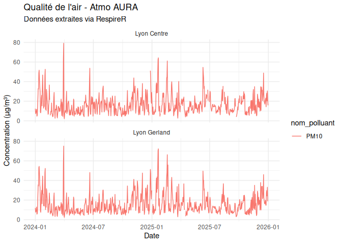

# RespireR

Quelques fonction R pour récupérer les mesures de qualité de l’air en
Auvergne-Rhône-Alpes à partir des API publiques d’Atmo AURA.

L’objectif est simple : - lister les stations fixes - récupérer des
mesures (NO2, PM10, PM2.5, O3, SO2) - sur une ou plusieurs stations -
pour une ou plusieurs années

Ce n’est pas un package ultra-générique, mais plutôt un outil pratique
pour explorer rapidement de façon automatisée les données Atmo côté
Rhône-Alpes.

## Installation

Vous pouvez installer depuis GitHub avec :

    # install.packages("remotes")
    remotes::install_github("rmartinie/RespireR")

## Fonctions disponibles

### `get_list_stations()`

Récupère la liste des stations fixes Atmo AURA.

Retourne un `data.frame` avec : - `id_station` - `nom_station` -
`date_debut`, `date_fin` - `en_service` - `typologie`

### `get_atmo()`

Récupère les mesures **pour une année donnée**.

- stations : vecteur d’ID ou `data.frame` issu de `get_list_stations()`
- polluants : codes numériques (ex : `24` pour PM10, `01` pour SO2)
- année : ex `2024`

### `get_atmo_history()`

Récupère l’historique **sur plusieurs années**, et sort tout dans un
seul tableau.

## Tables des polluants

| Code | Polluant |
|-----:|----------|
|   01 | SO₂      |
|   03 | NO₂      |
|   08 | O₃       |
|   24 | PM10     |
|   39 | PM2.5    |

## Exemple d’utilisation complet

``` r
library(RespireR)

df_stations_ref <- get_list_stations()
```

    ## Récupération de la liste des stations...

``` r
# Ici, on sélectionne deux stations lyonnaises par exemple
stations_cibles <- df_stations_ref |>
  dplyr::filter(id_station %in% c("FR20017", "FR20062"))


# On récupère les PM10 (24) et le SO2 (01) sur 2024-2025
df_mesures <- get_atmo_bulk(
  df_stations = stations_cibles, 
  polluant_id = c("24", "01"), 
  annee_debut = 2024, 
  annee_fin = 2025
)
```

    ## 
    ## >>> Année : 2024

    ## Lancement : 2 stations x 2 polluants...

    ## 
    ## >>> Année : 2025

    ## Lancement : 2 stations x 2 polluants...

``` r
knitr::kable(head(df_mesures))
```

| date       | valeur | station | nom_station  | polluant | nom_polluant |
|:-----------|-------:|:--------|:-------------|:---------|:-------------|
| 2024-01-01 |   12.0 | FR20017 | Lyon Gerland | 24       | PM10         |
| 2024-01-02 |    7.6 | FR20017 | Lyon Gerland | 24       | PM10         |
| 2024-01-03 |    8.4 | FR20017 | Lyon Gerland | 24       | PM10         |
| 2024-01-04 |    9.9 | FR20017 | Lyon Gerland | 24       | PM10         |
| 2024-01-05 |   12.9 | FR20017 | Lyon Gerland | 24       | PM10         |
| 2024-01-06 |    5.6 | FR20017 | Lyon Gerland | 24       | PM10         |

``` r
library(ggplot2)
ggplot(df_mesures, aes(x = date, y = valeur, color = nom_polluant)) +
  geom_line() +
  facet_wrap(~nom_station, ncol = 1) +
  theme_minimal() +
  labs(title = "Qualité de l'air - Atmo AURA",
       y = "Concentration (µg/m³)", x = "Date")
```

<!-- -->
